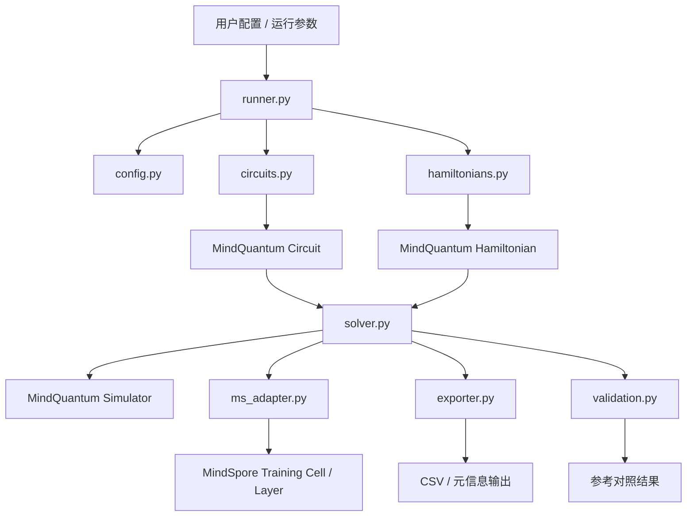
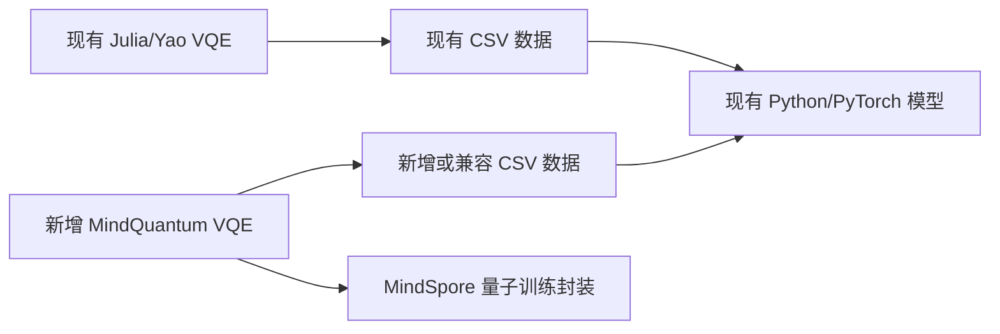
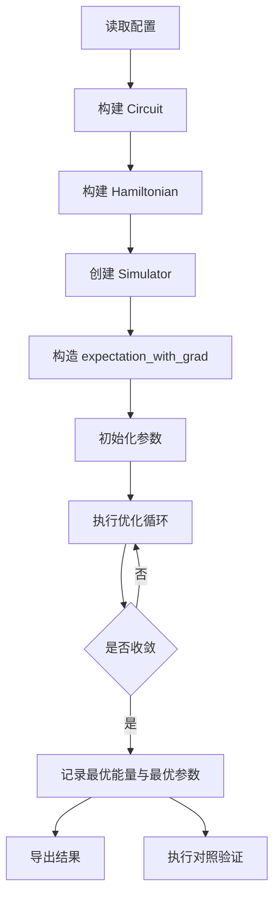
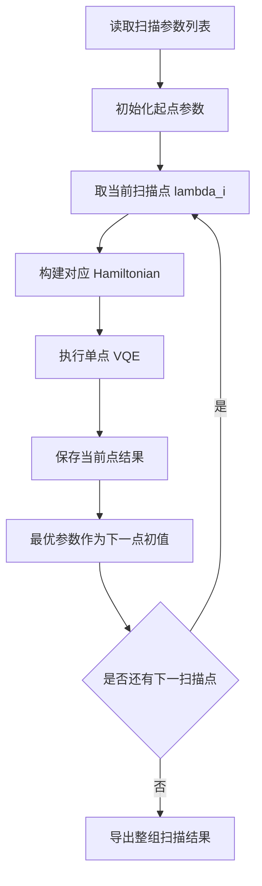
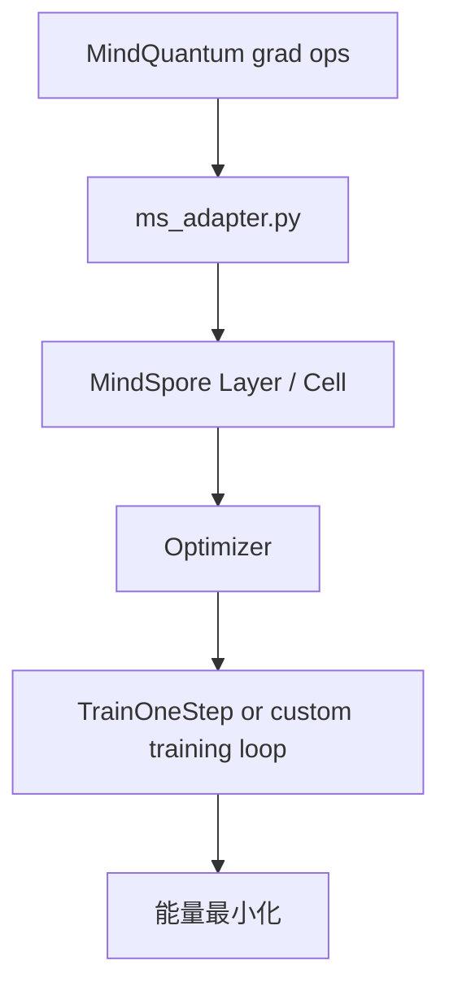

# desing.md

## 1. 文档目的

本文档基于 `requirements.md` 中已冻结的需求，给出 `attention-pqc` 代码库新增 **MindQuantum VQE 求解能力** 与 **MindSpore 模型封装能力** 的技术设计方案。

本文档只描述：

1. 目标架构；
2. 模块划分；
3. 核心流程；
4. 关键技术决策；
5. 风险与验证设计；
6. 交付边界。

本文档不包含具体实现代码，后续实现必须以本文档为依据拆分为原子任务。

---

## 2. 设计目标

本设计需要满足以下目标：

1. 在当前仓库中新增一条 **Python 原生** 的 VQE 求解链路；
2. 使用 **MindQuantum** 负责量子线路、哈密顿量、期望值与梯度计算；
3. 使用 **MindSpore** 负责量子训练单元封装与后续混合建模扩展基础；
4. 尽可能保留当前 Julia/Yao 流程中的有效语义，尤其是：
   - 层状 ansatz；
   - 自旋模型哈密顿量；
   - 参数扫描；
   - warm start / continuation；
5. 与现有 Python 数据读取与下游训练流程保持低耦合兼容；
6. 保证第一版优先可验证、可复现、可扩展，而不是一次性重构全部旧代码。

---

## 3. 现状架构分析

当前仓库本质上是“两阶段、双语言、双框架”的实验结构：

1. **Julia + Yao.jl**：负责量子线路定义、哈密顿量定义、VQE 求解与 CSV 导出；
2. **Python + PyTorch**：负责读取 CSV 数据，并训练 VAE / Attention VAE / Diffusion 模型。

这条现有链路具备以下特征：

- 量子定义和求解集中在 Julia；
- Python 侧没有一套独立的 VQE 求解器；
- 现有参数扫描依赖“复用上一点最优参数”的 warm start 语义；
- 下游数据消费依赖稳定的 CSV 参数顺序与标签结构。

因此，新增 MindQuantum + MindSpore 方案时，不适合直接覆盖旧链路，而应设计为：

- **一条并行的新 Python 求解链路**；
- 与现有数据消费方式兼容；
- 后续可逐步扩展，而不是一步迁移全部旧实验资产。

---

## 4. 总体设计原则

### 4.1 并行接入，不破坏旧链路
第一版新增能力与现有 Julia/Yao、PyTorch 流程并存，避免高风险替换。

### 4.2 量子求解内核与训练封装解耦
量子电路/哈密顿量/期望值梯度计算应独立于 MindSpore 训练壳，使：

- 数值正确性更容易验证；
- 可在纯 Python 调试；
- 未来可替换优化策略。

### 4.3 保留 continuation 语义
参数扫描式 VQE 必须保留 warm start 机制，以维持当前实验语义与性能特征。

### 4.4 先支持最小闭环，再扩展模型迁移
第一版重点是“求解能力 + 数据导出 + MindSpore 封装基础”，而不是迁移全部现有生成模型。

### 4.5 明确边界，避免框架混用
PyTorch 与 MindSpore 在第一版中只通过文件或 NumPy 边界交互，不做跨框架自动求导混合。

---

## 5. 目标架构

### 5.1 架构概览

目标架构由 6 个核心层组成：

1. **配置层**：统一描述 qubit 数、深度、哈密顿量、扫描区间、优化器参数、输出路径等；
2. **量子构造层**：负责构建 MindQuantum `Circuit` 与 `Hamiltonian`；
3. **求解内核层**：负责期望值、梯度、优化循环与 warm start；
4. **MindSpore 封装层**：将量子求解能力包装为标准训练单元；
5. **结果导出层**：输出 CSV / 元信息 / 日志；
6. **验证与对照层**：负责小规模基准校验和一致性验证。

### 5.2 目标模块划分

建议新增一组独立的 Python 模块，逻辑结构如下：

```text
mindquantum_vqe/
├── __init__.py
├── config.py
├── circuits.py
├── hamiltonians.py
├── solver.py
├── ms_adapter.py
├── runner.py
├── exporter.py
└── validation.py
```

### 5.3 模块职责

#### `config.py`
负责：
- 运行配置定义；
- 默认参数；
- 配置校验；
- 配置序列化。

#### `circuits.py`
负责：
- 参数化电路模板构建；
- 参数命名规则；
- 参数顺序稳定化；
- 支持与现有 `t_circuit` / 层状旋转-纠缠模板语义对齐。

#### `hamiltonians.py`
负责：
- transverse-Ising；
- cluster-Ising；
- 周期边界项；
- `QubitOperator` 与 `Hamiltonian` 组装。

#### `solver.py`
负责：
- 构建 `Simulator`；
- 获取 expectation with grad；
- 执行单点 VQE；
- 执行扫描 VQE；
- 管理 warm start；
- 记录收敛历史。

#### `ms_adapter.py`
负责：
- 将量子期望值梯度接口适配为 MindSpore 可训练单元；
- 封装 `MQAnsatzOnlyLayer` 或等价的 MindSpore 训练入口；
- 提供统一训练/评估接口。

#### `runner.py`
负责：
- 作为主执行入口；
- 解析配置；
- 选择单点求解 / 扫描求解；
- 协调导出与验证步骤。

#### `exporter.py`
负责：
- 导出参数、能量、标签和元信息；
- 兼容现有 CSV 消费方式；
- 生成运行摘要。

#### `validation.py`
负责：
- 小规模数值对照；
- 有限差分梯度校验；
- 与参考解/对角化结果比对。

---

## 6. 架构图

### 6.1 目标组件架构图



### 6.2 与现有链路的并行关系图



设计重点是：

- 保留 `A -> B -> C` 旧链路；
- 新增 `D -> E -> C` 与 `D -> F` 新链路；
- 避免第一版直接把 `C` 整体迁移到 MindSpore。

---

## 7. 核心流程设计

### 7.1 单点 VQE 流程



### 7.2 扫描式 VQE 流程



### 7.3 MindSpore 封装流程



---

## 8. 详细设计

### 8.1 配置模型设计

配置模型建议分为 5 类信息：

1. **系统配置**
   - `n_qubits`
   - `depth`
   - `hamiltonian_type`
   - `boundary_condition`

2. **扫描配置**
   - `lambda_start`
   - `lambda_stop`
   - `lambda_step`
   - `warm_start`

3. **优化配置**
   - `optimizer_type`
   - `learning_rate`
   - `max_iters`
   - `tol`
   - `seed`

4. **执行配置**
   - `mode = single | scan`
   - `device_target`
   - `mindspore_mode = PYNATIVE`

5. **输出配置**
   - `output_dir`
   - `export_csv`
   - `export_history`
   - `run_name`

### 8.2 电路构建设计

#### 8.2.1 设计目标

电路构建层需满足：

1. 参数数量可预测；
2. 参数名称稳定；
3. 参数顺序可复现；
4. 能映射现有层状 Julia 电路语义；
5. 后续易扩展更多 ansatz。

#### 8.2.2 参数命名策略

参数名统一采用：

- `theta_l{layer}_q{qubit}_rx`
- `theta_l{layer}_q{qubit}_ry`
- `theta_l{layer}_q{qubit}_rz`
- `theta_l{layer}_e{edge}_zz`

设计目的：

- 明确层、量子位、门类型；
- 保证导出时参数顺序可读；
- 降低下游 CSV 解释成本。

#### 8.2.3 电路模板策略

第一版建议至少支持两类模板：

1. **基础旋转 + CZ 纠缠层模板**
   - 用于快速验证；
   - 与现有层状线路结构接近；

2. **与现有 `t_circuit` 语义对齐的主模板**
   - 作为第一版主支持模板；
   - 用于与当前 Julia 流程对照。

设计上不建议第一版同时覆盖过多线路模板，否则验证成本高于收益。

### 8.3 哈密顿量构建设计

#### 8.3.1 哈密顿量表示

采用如下抽象：

- 输入：系统规模、控制参数、模型类型、边界条件；
- 输出：`Hamiltonian(QubitOperator(...))`。

#### 8.3.2 支持模型

第一版应优先支持：

1. `transverse_ising`
2. `cluster_ising_2`
3. 视工作量决定是否同步补 `cluster_ising_3`

优先级原因：

- 当前 Julia 主流程实际使用 cluster-Ising 类模型；
- 先覆盖现有主路径，验证价值最高。

#### 8.3.3 索引策略

所有内部实现统一采用 Python / MindQuantum 的 `0-based index`，并在构建周期边界项时统一走一个边索引生成器，避免：

- 多处重复环边公式；
- 迁移时产生 off-by-one 错误；
- 不同哈密顿量实现各自使用不一致索引规则。

### 8.4 求解内核设计

#### 8.4.1 核心职责

求解内核负责四类能力：

1. 构造 expectation + gradient 接口；
2. 管理可训练参数；
3. 执行优化循环；
4. 输出标准求解结果对象。

#### 8.4.2 求解结果对象

建议统一结果对象字段：

- `status`
- `best_energy`
- `best_params`
- `final_energy`
- `n_iters`
- `converged`
- `history`
- `lambda_value`
- `reference_energy`
- `energy_gap`
- `metadata`

#### 8.4.3 单点求解接口

建议抽象接口：

- 输入：
  - Hamiltonian
  - Circuit
  - initial_params
  - optimizer config
- 输出：
  - 单点求解结果对象

#### 8.4.4 扫描求解接口

建议抽象接口：

- 输入：
  - 扫描参数列表
  - 电路模板
  - 哈密顿量生成器
  - 初始参数策略
- 输出：
  - 按扫描顺序排列的结果集合

#### 8.4.5 Warm Start 设计

warm start 必须是求解器的一等公民，而不是调用方自行拼接。具体规则：

1. 第一扫描点使用显式初始值或默认初始化；
2. 第 `i` 个扫描点完成后，将其 `best_params` 复制为第 `i+1` 个点的初始参数；
3. 支持关闭 warm start，以便做对照实验；
4. 日志中明确记录每个点的初始化来源。

#### 8.4.6 优化策略设计

第一版建议支持以下两层优化策略：

1. **主策略**：MindSpore 优化封装的量子训练步骤；
2. **备选策略**：纯求解循环接口，用于数值调试与对照。

原因：

- 满足“使用 MindSpore 进行模型构建”的需求；
- 同时保留更易调试的低耦合路径；
- 避免把所有数值问题都隐藏在训练壳内部。

### 8.5 MindSpore 封装设计

#### 8.5.1 设计目标

MindSpore 层的角色不是替代 MindQuantum，而是：

1. 统一参数管理；
2. 提供标准训练入口；
3. 为后续量子-经典混合网络做准备。

#### 8.5.2 封装策略

第一版采用“薄封装”策略：

- MindQuantum 负责量子电路与梯度；
- MindSpore 负责训练 cell、优化器与训练步组织；
- 不在第一版把复杂业务逻辑埋进 MindSpore 网络结构内部。

#### 8.5.3 推荐结构

`ms_adapter.py` 内建议包含：

1. `VQEAnsatzCell`
   - 封装量子能量计算；
   - 作为训练目标网络；

2. `build_training_cell(config)`
   - 根据配置创建优化器；
   - 返回训练网络；

3. `run_train_step(...)`
   - 对单步训练做薄包装；
   - 便于统一日志记录。

#### 8.5.4 运行模式

设计上默认采用：

- `MindSpore PYNATIVE_MODE`

原因：

- 与 MindQuantum 训练接口兼容性更稳；
- 调试更直观；
- 更适合第一版验证。

### 8.6 导出设计

#### 8.6.1 输出目标

导出层既要支持“工程审计”，又要兼容现有下游数据消费。

#### 8.6.2 输出内容

建议至少输出以下对象：

1. **参数 CSV**
   - 每个扫描点对应一条参数向量；
   - 含标签列与元信息列；

2. **结果摘要 CSV / JSON**
   - 最优能量；
   - 迭代次数；
   - 收敛状态；
   - 参考误差；

3. **运行元信息**
   - 配置快照；
   - 时间戳；
   - 软件版本；
   - 随机种子。

#### 8.6.3 兼容策略

导出格式优先遵循现有数据消费需求：

1. 参数列按固定顺序排列；
2. 标签字段可直接映射到现有 `read_file` 一类数据读取逻辑；
3. 若完全兼容现有目录结构代价过高，则至少保持字段语义稳定。

### 8.7 验证设计

验证设计按“由浅入深”分三层：

#### 第一层：构建正确性
验证：
- 电路参数数量是否正确；
- 哈密顿量项数是否正确；
- 边界条件项是否完整。

#### 第二层：数值正确性
验证：
- 小规模系统的能量是否与解析/对角化一致；
- 梯度是否与有限差分一致；
- 无 warm start 与 warm start 的收敛曲线是否符合预期。

#### 第三层：流程正确性
验证：
- 扫描输出点数是否正确；
- 输出参数顺序是否稳定；
- 导出结果是否能被现有数据链路消费。

---

## 9. 数据模型设计

### 9.1 输入数据模型

单点求解输入最少包含：

- 系统规模；
- 深度；
- 哈密顿量类型；
- 控制参数值；
- 优化超参数；
- 随机种子；
- 输出配置。

扫描求解输入在此基础上增加：

- 参数区间；
- 步长；
- warm start 开关。

### 9.2 运行态数据模型

运行过程中维护：

- `current_params`
- `best_params`
- `current_energy`
- `best_energy`
- `grad_norm`
- `iter_idx`
- `lambda_idx`
- `lambda_value`
- `init_source`

### 9.3 输出数据模型

扫描输出应至少形成两类表：

#### 结果总表
包含：
- `lambda_value`
- `best_energy`
- `reference_energy`
- `energy_gap`
- `n_iters`
- `converged`
- `seed`

#### 参数表
包含：
- `lambda_value`
- `param_0 ... param_n`
- `param_name_0 ... param_name_n` 或固定列头映射

设计建议：

- 第一版优先采用宽表结构，便于直接供现有 CSV 流程消费；
- 参数名映射可通过元信息文件保存，避免 CSV 头部过长。

---

## 10. 关键技术决策

### KD-1 新增并行 Python 链路，而不是替换旧链路

**决策**：新增 `MindQuantum + MindSpore` 求解路径，与现有 Julia/Yao 和 PyTorch 路径并存。

**原因**：
- 降低一次性替换风险；
- 便于与现有结果做数值对照；
- 保证当前实验资产可继续使用。

**取舍**：
- 会短期形成多栈并存；
- 但可获得更平滑的迁移路径。

### KD-2 优先采用通用自旋模型 API，而不是化学专用工作流

**决策**：基于 `Circuit + QubitOperator + Hamiltonian + Simulator` 设计核心求解器。

**原因**：
- 当前仓库核心问题是自旋模型，不是化学分子；
- 与现有电路/哈密顿量语义最贴近；
- 可最大化复用当前问题定义。

### KD-3 量子求解内核与 MindSpore 封装分层

**决策**：将数值求解逻辑放在 `solver.py`，MindSpore 只做训练壳与参数管理。

**原因**：
- 易于测试；
- 易于调试；
- 易于后续切换优化器或比较不同封装方式。

### KD-4 Warm Start 作为核心能力内建

**决策**：扫描求解器内建 continuation 机制。

**原因**：
- 当前 Julia 主路径已依赖这一语义；
- 对扫描任务收敛效率和结果连续性有关键影响。

### KD-5 第一版使用 PYNATIVE 模式

**决策**：MindSpore 运行模式默认采用 `PYNATIVE_MODE`。

**原因**：
- 与 MindQuantum 接口适配风险更低；
- 调试成本更低；
- 符合第一版“先正确、后优化”的原则。

### KD-6 导出优先兼容现有 CSV 数据流

**决策**：导出设计以稳定参数顺序和 CSV 宽表为第一优先级。

**原因**：
- 现有 Python 数据管线已存在；
- 兼容导出可最大化复用下游代码；
- 降低新旧链路并存成本。

### KD-7 第一版先聚焦求解器，不迁移全部生成模型

**决策**：不在第一版同步完成 VAE / Diffusion 到 MindSpore 的全量迁移。

**原因**：
- 风险过大；
- 与本次核心目标不完全一致；
- 会稀释对求解正确性的验证资源。

---

## 11. 风险与缓解设计

### 11.1 版本兼容风险

**风险**：MindQuantum、MindSpore、Python、macOS 平台存在组合兼容问题。

**缓解**：
- 在实现前锁定推荐版本矩阵；
- 提供启动时版本检查；
- 在配置与错误信息中明确版本要求。

### 11.2 索引与端序风险

**风险**：Julia 1-based 到 Python 0-based 迁移，以及 qubit ordering 不一致可能导致静默错误。

**缓解**：
- 统一边索引生成器；
- 先做小规模解析对照；
- 对每类哈密顿量建立最小测试样例。

### 11.3 扫描收敛退化风险

**风险**：若 warm start 设计不当，扫描式 VQE 会显著退化。

**缓解**：
- 将 warm start 纳入求解器核心接口；
- 对比开启/关闭 warm start 的收敛行为；
- 记录每个扫描点的初始化来源。

### 11.4 训练封装过重风险

**风险**：若一开始就把复杂流程深埋进 MindSpore `Cell`，调试成本高。

**缓解**：
- 采用薄封装；
- 保留 solver 层独立可调试入口；
- 先验证数值，再优化训练接口。

### 11.5 下游兼容风险

**风险**：导出格式不兼容现有数据读取与训练逻辑。

**缓解**：
- 设计阶段即约束参数顺序；
- 输出时保留标签与元信息；
- 实现阶段增加与现有数据读取链路的兼容验证。

---

## 12. 方案对比与取舍

### 12.1 方案 A：直接替换 Julia 主链路

**优点**：
- 最终栈统一；
- 结构更简洁。

**缺点**：
- 风险过高；
- 缺少过渡期对照；
- 一旦数值不一致，很难定位问题。

**结论**：第一版不采用。

### 12.2 方案 B：新增并行 Python 链路

**优点**：
- 风险可控；
- 便于做对照验证；
- 符合渐进迁移策略。

**缺点**：
- 短期存在多栈并存；
- 需要额外说明新旧边界。

**结论**：第一版采用。

### 12.3 方案 C：先只做 MindQuantum，不引入 MindSpore

**优点**：
- 实现更轻；
- VQE 调试更直接。

**缺点**：
- 不满足“使用 MindSpore 进行模型构建”的目标；
- 不能为后续混合模型预留统一封装基础。

**结论**：不采用为主方案，但其“低耦合求解接口”思想会保留在 solver 设计中。

---

## 13. 实施边界

### 13.1 第一版必须交付

1. 至少一种主线路模板；
2. 至少一种现有主用哈密顿量；
3. 单点 VQE 求解；
4. 扫描式 VQE + warm start；
5. MindSpore 训练/量子层封装基础；
6. 结构化导出；
7. 小规模验证机制。

### 13.2 第一版可延期能力

1. 多种高级 ansatz 全覆盖；
2. 全部现有模型迁移到 MindSpore；
3. 高级可视化报表；
4. 分布式或高性能优化；
5. 完整 notebook 生态重构。

---

## 14. 验证与验收设计

### 14.1 构建层验收

- 电路参数数量与设计一致；
- 哈密顿量项数量与手工推导一致；
- 周期边界项正确生成。

### 14.2 求解层验收

- 单点求解能够正常收敛或给出明确失败原因；
- 扫描任务能按配置输出所有点；
- warm start 生效并体现在日志中。

### 14.3 数值层验收

- 小规模问题能量与参考解一致；
- 梯度通过有限差分抽查；
- 参数顺序稳定且导出可复现。

### 14.4 工程层验收

- 存在明确运行入口；
- 输出目录结构清晰；
- 错误信息可读；
- 新旧链路可并存。

---

## 15. 与现有代码的映射关系

本设计与当前仓库已有实现的对应关系如下：

1. 现有 `vqe/circuits.jl` 的层状电路语义，将映射到新的 `circuits.py`；
2. 现有 `vqe/hamiltonians.jl` 的自旋模型定义，将映射到新的 `hamiltonians.py`；
3. 现有 `getDataset.jl` 的单点求解与扫描逻辑，将映射到新的 `solver.py + runner.py`；
4. 现有数据导出与 Python 数据消费接口之间的关系，将由 `exporter.py` 负责衔接；
5. 未来若将量子能力嵌入更复杂模型，则通过 `ms_adapter.py` 承接。

---

## 16. 设计结论

本设计选择了一条 **保守但可扩展** 的路径：

1. 不直接推翻现有 Julia/Yao 与 PyTorch 链路；
2. 新增一条 MindQuantum + MindSpore 的 Python 求解路径；
3. 把“量子求解正确性”与“MindSpore 封装”分层设计；
4. 把 warm start、CSV 兼容和小规模验证作为第一版核心要求；
5. 为后续更大范围的 MindSpore 化保留接口，而不在第一版过度承诺。

该设计在满足需求的同时，最大化降低了迁移风险，并能为后续实现阶段提供清晰边界。

---

## 17. 进入下一阶段的条件

只有当以下条件满足后，才能进入 `task.md` 阶段：

1. 本文档审查通过；
2. 若有关键设计分歧，已在本文档中修订并冻结；
3. 模块边界、主流程、关键决策与验收策略获得确认。
