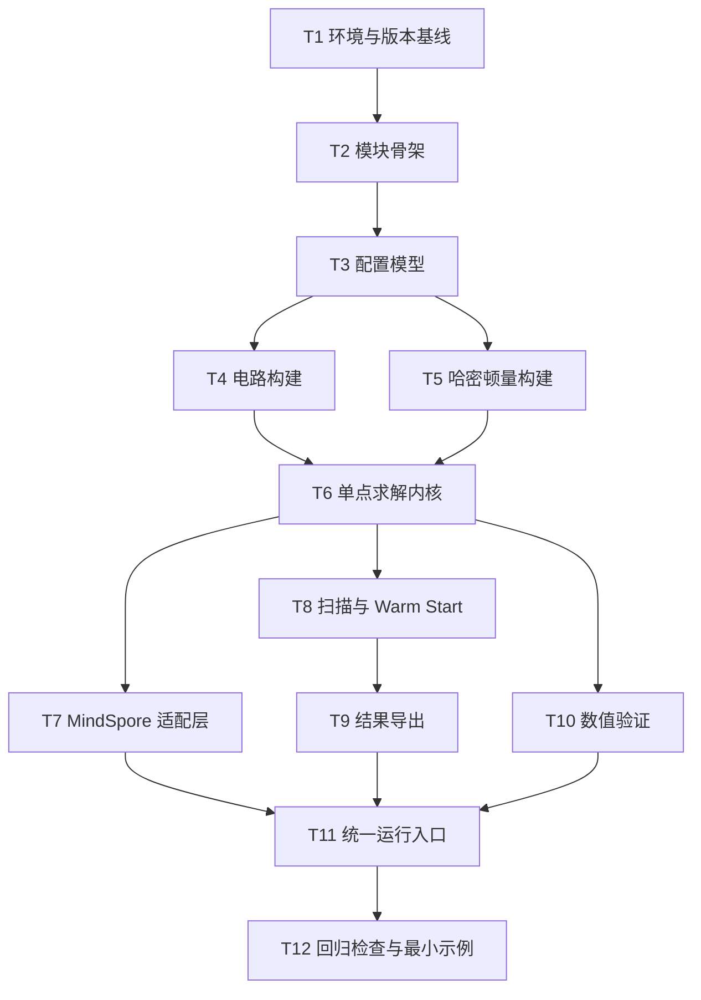

# task.md

## 1. 文档目的

本文档基于已审查通过的 `requirements.md` 与 `desing.md`，将“在当前代码库中新增基于 MindQuantum 的 VQE 求解能力，并使用 MindSpore 进行模型构建”的实现工作，拆分为**可执行、可验收、尽量原子化**的任务列表。

本文档用于指导后续实现执行，范围严格受前两份文档约束，不新增未批准目标。

---

## 2. 执行原则

1. 严格按照 `spec -> design -> tasks -> implementation` 顺序执行；
2. 优先实现第一版最小闭环；
3. 每个任务必须有明确输入、输出、完成标准；
4. 每个任务完成后应可单独验证；
5. 不破坏现有 Julia/Yao 与 PyTorch 链路；
6. 先保证正确性与兼容性，再考虑性能优化。

---

## 3. 现有实现基线

以下现有文件是本次实现任务拆分的直接基线：

- 当前 VQE 主流程：`getDataset.jl:15-55`
- 当前参数扫描与 warm start 语义：`getDataset.jl:60-70`
- 当前量子线路模板：`vqe/circuits.jl:1-55`
- 当前哈密顿量定义：`vqe/hamiltonians.jl:1-36`
- 当前 Python 数据读取：`utls.py:35-67`
- 当前训练入口示例：`train_example.ipynb:31-96`
- 当前主要 PyTorch 模型链路：`models/ctvae_res.py:83-242`

---

## 4. 交付范围

第一版任务拆分仅覆盖以下交付：

1. Python 原生 MindQuantum VQE 求解链路；
2. MindSpore 量子训练/封装基础；
3. 单点 VQE；
4. 扫描式 VQE + warm start；
5. 结构化结果导出；
6. 小规模数值验证；
7. 与现有 CSV 数据流程的基础兼容。

不包含：

1. 全量迁移现有 PyTorch 模型到 MindSpore；
2. 替换现有 Julia/Yao 主链路；
3. 构建完整平台化系统；
4. 分布式优化和高级性能调优。

---

## 5. 任务分解总览



---

## 6. 原子任务清单

> 说明：
> - `前置` 表示依赖关系；
> - `产出` 表示完成后必须存在的结果；
> - `完成标准` 表示可关闭该任务的最低条件。

### T1. 锁定 MindQuantum / MindSpore 版本基线

- **目标**：确定第一版支持的软件版本矩阵与本地运行前提。
- **前置**：无。
- **执行内容**：
  1. 确认 Python 版本目标范围；
  2. 确认 MindQuantum 与 MindSpore 的兼容版本组合；
  3. 确认 macOS 下默认以 CPU 作为运行假设；
  4. 形成代码内需要校验的版本常量或运行说明。
- **产出**：
  - 版本基线结论；
  - 运行时版本检查需求清单。
- **完成标准**：
  - 后续实现可依据该基线编写导入与错误处理逻辑；
  - 版本要求不再模糊。

### T2. 创建新增 Python 模块骨架

- **目标**：建立新的 MindQuantum VQE 代码组织边界。
- **前置**：T1。
- **执行内容**：
  1. 创建独立模块目录；
  2. 创建以下文件骨架：
     - `config.py`
     - `circuits.py`
     - `hamiltonians.py`
     - `solver.py`
     - `ms_adapter.py`
     - `runner.py`
     - `exporter.py`
     - `validation.py`
     - `__init__.py`
  3. 补齐最小导入结构与占位接口。
- **产出**：
  - 可导入的模块骨架。
- **完成标准**：
  - 新模块可被 Python 成功导入；
  - 不影响现有目录结构和已有脚本。

### T3. 实现统一配置模型与配置校验

- **目标**：让单点求解、扫描求解、导出、验证共享统一配置结构。
- **前置**：T2。
- **执行内容**：
  1. 定义系统配置字段：qubit 数、深度、模型类型、边界条件；
  2. 定义扫描配置字段：起止值、步长、warm start 开关；
  3. 定义优化配置字段：学习率、最大迭代、容差、随机种子；
  4. 定义运行配置字段：单点/扫描模式、MindSpore mode、device；
  5. 定义输出配置字段：输出路径、导出开关、运行名；
  6. 增加非法配置检查。
- **产出**：
  - 配置数据结构；
  - 配置校验逻辑；
  - 默认值策略。
- **完成标准**：
  - 可以从单一配置对象驱动后续模块；
  - 非法参数能得到明确错误。

### T4. 实现基础边索引与周期边界工具

- **目标**：为电路和哈密顿量统一提供安全的 0-based 索引工具。
- **前置**：T3。
- **执行内容**：
  1. 编写线性邻接边生成器；
  2. 编写周期边界邻接边生成器；
  3. 编写三体 cluster 项索引生成器；
  4. 增加索引范围断言与顺序规范。
- **产出**：
  - 通用索引工具函数。
- **完成标准**：
  - 后续电路与哈密顿量模块不再各自重复写环边公式；
  - 可覆盖 `vqe/circuits.jl:1-55` 与 `vqe/hamiltonians.jl:1-36` 对应的邻接关系语义。

### T5. 实现主线路模板参数命名规则

- **目标**：固定参数顺序与参数名称，确保导出稳定。
- **前置**：T3、T4。
- **执行内容**：
  1. 定义按层、量子位、门类型命名的参数名生成规则；
  2. 定义参数顺序生成器；
  3. 定义参数数量计算函数；
  4. 为导出层暴露参数名列表接口。
- **产出**：
  - 参数名生成逻辑；
  - 参数顺序定义。
- **完成标准**：
  - 同一配置下多次构建得到完全一致的参数顺序；
  - 可追溯对应的层和门。

### T6. 实现基础旋转 + 纠缠层 Circuit 构建

- **目标**：完成第一类最小可验证电路模板。
- **前置**：T4、T5。
- **执行内容**：
  1. 使用 MindQuantum 构建单层旋转门；
  2. 构建 CZ 或设计指定的纠缠层；
  3. 支持按深度堆叠；
  4. 输出电路对象、参数名、参数数量。
- **产出**：
  - 基础电路构建函数。
- **完成标准**：
  - 电路可成功实例化；
  - 参数数量与命名规则一致；
  - 可作为求解器输入。

### T7. 实现与现有 `t_circuit` 语义对齐的主线路模板

- **目标**：复现当前主路径所需的层状 ansatz 语义。
- **前置**：T4、T5、T6。
- **执行内容**：
  1. 分析 `t_circuit` 的层结构与门序关系，基于 `vqe/circuits.jl:28-55` 实现等价模板；
  2. 实现单层构建与多层叠加；
  3. 确认 qubit 顺序和边顺序一致；
  4. 输出模板构建接口。
- **产出**：
  - 主线路模板构建函数。
- **完成标准**：
  - 主模板能作为第一版默认 ansatz；
  - 参数顺序固定；
  - 语义可用于后续与 Julia 结果对照。

### T8. 实现 transverse-Ising Hamiltonian 构建

- **目标**：实现第一类基础哈密顿量，便于最小验证。
- **前置**：T3、T4。
- **执行内容**：
  1. 实现 Pauli 项拼装；
  2. 支持横场项与耦合项；
  3. 支持边界条件；
  4. 返回 MindQuantum `Hamiltonian`。
- **产出**：
  - transverse-Ising 构建函数。
- **完成标准**：
  - 项数正确；
  - 小规模手工项检查通过。

### T9. 实现 cluster-Ising-2 Hamiltonian 构建

- **目标**：实现与当前主流程直接相关的哈密顿量。
- **前置**：T4、T8。
- **执行内容**：
  1. 按 `vqe/hamiltonians.jl:26-36` 语义实现三体 cluster 项；
  2. 实现 `YY` 相互作用项；
  3. 支持周期边界；
  4. 返回 `Hamiltonian`。
- **产出**：
  - cluster-Ising-2 构建函数。
- **完成标准**：
  - 项结构与当前 Julia 语义一致；
  - 可直接用于默认扫描求解。

### T10. 预留 cluster-Ising-3 扩展接口

- **目标**：为后续模型扩展保留稳定入口，但不扩大第一版实现范围过多。
- **前置**：T9。
- **执行内容**：
  1. 定义模型类型分发接口；
  2. 为 cluster-Ising-3 预留函数签名；
  3. 在未实现情况下提供明确错误信息。
- **产出**：
  - 哈密顿量分发框架。
- **完成标准**：
  - 第一版不会因未来扩展而重写接口；
  - 未实现模型类型会得到清晰反馈。

### T11. 实现 Simulator 初始化与 expectation-with-grad 封装

- **目标**：完成求解器最核心的量子数值入口。
- **前置**：T6/T7、T8/T9。
- **执行内容**：
  1. 创建 MindQuantum Simulator；
  2. 绑定 Circuit 与 Hamiltonian；
  3. 封装 expectation + gradient 调用接口；
  4. 标准化输出 energy 和 grad。
- **产出**：
  - 可复用的量子能量梯度函数。
- **完成标准**：
  - 对固定参数输入可返回数值能量与梯度；
  - 接口可供单点求解循环反复调用。

### T12. 实现参数初始化策略

- **目标**：为单点求解和扫描求解提供统一初始化逻辑。
- **前置**：T3、T11。
- **执行内容**：
  1. 实现零初始化；
  2. 实现随机初始化；
  3. 实现显式给定初值；
  4. 统一返回标准参数向量。
- **产出**：
  - 参数初始化模块。
- **完成标准**：
  - 初始化方式可配置；
  - 输出维度严格匹配参数数量。

### T13. 实现单点 VQE 求解循环

- **目标**：打通第一版最小求解闭环。
- **前置**：T11、T12。
- **执行内容**：
  1. 实现单点训练/优化循环；
  2. 跟踪当前能量、最优能量和参数；
  3. 实现最大迭代与容差停止条件；
  4. 记录 history；
  5. 统一返回结果对象。
- **产出**：
  - 单点求解函数；
  - 结果对象定义。
- **完成标准**：
  - 在小规模问题上可完成一次完整求解；
  - 输出含状态、最优值、历史记录。

### T14. 实现求解日志与状态码规范

- **目标**：让求解过程具备可观测性和可诊断性。
- **前置**：T13。
- **执行内容**：
  1. 定义状态码：成功、未收敛、配置错误、运行错误；
  2. 输出迭代日志；
  3. 输出停止原因；
  4. 统一异常包装。
- **产出**：
  - 日志格式；
  - 结果状态规范。
- **完成标准**：
  - 失败不会静默发生；
  - 结果可读、可排障。

### T15. 实现扫描参数列表生成

- **目标**：标准化参数扫描的输入序列。
- **前置**：T3。
- **执行内容**：
  1. 根据起止值和步长生成扫描点；
  2. 处理浮点边界；
  3. 保证顺序稳定；
  4. 输出标签列表。
- **产出**：
  - 扫描点生成函数。
- **完成标准**：
  - 扫描点数可预测；
  - 起止边界逻辑明确。

### T16. 实现扫描式求解循环

- **目标**：支持多参数点逐点执行 VQE。
- **前置**：T13、T15。
- **执行内容**：
  1. 遍历扫描参数；
  2. 每个点构建对应哈密顿量；
  3. 调用单点求解；
  4. 收集每个点的结果对象；
  5. 统一返回扫描结果集合。
- **产出**：
  - 扫描求解函数。
- **完成标准**：
  - 能按配置输出整组结果；
  - 保持扫描顺序不变。

### T17. 实现 Warm Start / Continuation 机制

- **目标**：保留 `getDataset.jl:60-70` 中体现的连续扫描语义。
- **前置**：T16。
- **执行内容**：
  1. 将前一点 `best_params` 作为下一点默认初值；
  2. 支持通过配置关闭该行为；
  3. 在结果和日志中记录初始化来源；
  4. 确保参数复制而非原地共享引用。
- **产出**：
  - warm start 逻辑。
- **完成标准**：
  - 开启时下一点确实复用上一点最优参数；
  - 关闭时回退到独立初始化策略。

### T18. 实现 MindSpore 运行上下文初始化

- **目标**：建立稳定的 MindSpore 运行入口。
- **前置**：T1、T3。
- **执行内容**：
  1. 初始化 MindSpore context；
  2. 默认设置 `PYNATIVE_MODE`；
  3. 设置 device target；
  4. 对导入/版本/模式错误做明确信息输出。
- **产出**：
  - MindSpore 初始化逻辑。
- **完成标准**：
  - 在支持环境中可成功初始化；
  - 在不支持环境中能返回清晰错误。

### T19. 实现 MindSpore 量子训练单元薄封装

- **目标**：将量子求解接口包装为 MindSpore 可训练单元。
- **前置**：T11、T13、T18。
- **执行内容**：
  1. 设计量子能量 `Cell`；
  2. 封装可训练参数；
  3. 对接 MindSpore 优化器；
  4. 提供最小训练步接口。
- **产出**：
  - `ms_adapter.py` 核心训练封装。
- **完成标准**：
  - 可在 MindSpore 中执行能量最小化训练步；
  - 参数与求解器语义保持一致。

### T20. 实现单点 VQE 的 MindSpore 驱动路径

- **目标**：满足“使用 MindSpore 进行模型构建”的核心需求。
- **前置**：T19。
- **执行内容**：
  1. 用 MindSpore 优化器驱动一个单点 VQE；
  2. 记录训练损失/能量变化；
  3. 与低耦合求解路径对齐输出结构。
- **产出**：
  - MindSpore 驱动的单点求解入口。
- **完成标准**：
  - 至少一个单点案例可在 MindSpore 路径下跑通；
  - 输出结果结构与主求解器兼容。

### T21. 实现结果对象与扫描结果对象序列化

- **目标**：统一导出前的内存结构。
- **前置**：T13、T16。
- **执行内容**：
  1. 定义单点结果对象；
  2. 定义扫描结果集合对象；
  3. 实现转 dict / 表结构接口；
  4. 保留元信息字段。
- **产出**：
  - 标准结果数据模型。
- **完成标准**：
  - 导出层不依赖内部临时变量；
  - 结果结构稳定、可测试。

### T22. 实现参数 CSV 导出

- **目标**：导出与现有数据链路兼容的参数表。
- **前置**：T5、T21。
- **执行内容**：
  1. 定义宽表列结构；
  2. 导出 `lambda_value + param_0...param_n`；
  3. 保证参数顺序与参数名映射一致；
  4. 处理输出目录与命名。
- **产出**：
  - 参数 CSV 导出能力。
- **完成标准**：
  - 导出的参数文件可被现有 CSV 读取思路低成本消费，参考 `utls.py:35-67`；
  - 同配置下列顺序稳定。

### T23. 实现结果摘要导出

- **目标**：记录能量、收敛和元信息，便于审计与对照。
- **前置**：T21。
- **执行内容**：
  1. 导出每个扫描点的能量摘要；
  2. 导出迭代次数、状态码、收敛标记；
  3. 导出配置快照、随机种子、时间戳；
  4. 输出运行摘要文件。
- **产出**：
  - 结果摘要文件。
- **完成标准**：
  - 单次运行的关键信息可独立复盘；
  - 导出失败会给出明确信息。

### T24. 实现小规模参考能量计算或接入对照接口

- **目标**：为数值正确性验收提供基准。
- **前置**：T8、T9、T13。
- **执行内容**：
  1. 为小规模系统实现参考能量计算策略；
  2. 支持单点求解结果与参考值比对；
  3. 在结果中记录能量误差。
- **产出**：
  - 参考对照接口。
- **完成标准**：
  - 小规模问题可得到参考能量；
  - 求解结果中能附带误差字段。

### T25. 实现有限差分梯度抽查

- **目标**：降低量子梯度接口静默错误风险。
- **前置**：T11。
- **执行内容**：
  1. 对若干随机参数位置做有限差分近似；
  2. 与解析/自动梯度结果比较；
  3. 输出误差统计。
- **产出**：
  - 梯度校验函数。
- **完成标准**：
  - 能对关键电路/哈密顿量组合做抽查；
  - 误差超阈值时有明确失败信息。

### T26. 实现 Circuit / Hamiltonian 构建单元检查

- **目标**：确保基础构造逻辑在进入求解前就可验证。
- **前置**：T6、T7、T8、T9。
- **执行内容**：
  1. 检查参数数量；
  2. 检查项数量；
  3. 检查周期边界项存在性；
  4. 检查参数名顺序稳定性。
- **产出**：
  - 基础构建验证函数或测试。
- **完成标准**：
  - 关键构造逻辑有独立验证，不依赖完整求解运行。

### T27. 实现统一主入口 runner

- **目标**：提供稳定的执行入口，支持单点与扫描两种模式。
- **前置**：T3、T16、T20、T22、T23。
- **执行内容**：
  1. 解析配置；
  2. 选择单点或扫描模式；
  3. 选择普通求解路径或 MindSpore 驱动路径；
  4. 调用导出与验证；
  5. 返回最终运行状态。
- **产出**：
  - 统一运行入口。
- **完成标准**：
  - 用户可通过单一入口运行第一版核心功能；
  - 运行流程清晰、可重复。

### T28. 实现错误处理与用户可读报错

- **目标**：让版本、配置、构建、导出等错误可定位。
- **前置**：T27。
- **执行内容**：
  1. 处理依赖缺失；
  2. 处理版本不兼容；
  3. 处理非法配置；
  4. 处理导出失败；
  5. 处理未收敛结果。
- **产出**：
  - 统一错误信息策略。
- **完成标准**：
  - 常见失败路径均有清晰错误；
  - 不出现无上下文异常终止。

### T29. 兼容性验证：导出结果与现有 Python 数据链路对接检查

- **目标**：确保新增导出结果可被现有数据流程消费或低成本适配。
- **前置**：T22、T23。
- **执行内容**：
  1. 用现有 `utls.py:35-67` 的消费模式检查导出数据结构；
  2. 识别必须补齐的标签或目录约定；
  3. 若不能完全复用，则确认最小适配点。
- **产出**：
  - 兼容性检查结论；
  - 必要的适配说明或小改动清单。
- **完成标准**：
  - 新导出数据与现有链路关系明确；
  - 不存在未识别的数据格式断层。

### T30. 构建最小可运行示例

- **目标**：为第一版交付提供最小闭环演示。
- **前置**：T27、T29。
- **执行内容**：
  1. 选择一个小规模系统配置；
  2. 运行单点 VQE；
  3. 运行扫描式 VQE；
  4. 验证输出文件生成；
  5. 验证参考值与日志输出。
- **产出**：
  - 最小可运行样例配置与执行结果。
- **完成标准**：
  - 第一版闭环可完整演示；
  - 可作为后续回归检查基准。

### T31. 回归检查：确保旧链路未被破坏

- **目标**：保证新增实现不会破坏现有仓库主资产。
- **前置**：T30。
- **执行内容**：
  1. 确认现有 Julia 文件未被无关改动；
  2. 确认现有 PyTorch 模型链路仍可保留；
  3. 确认新增目录与输出命名不冲突；
  4. 检查旧 notebook 依赖未被连带破坏，参考 `train_example.ipynb:31-96`。
- **产出**：
  - 回归检查结论。
- **完成标准**：
  - 新旧链路可并存；
  - 不引入明显破坏性变更。

### T32. 最终验收核对

- **目标**：对照需求与设计逐项核验第一版交付。
- **前置**：T31。
- **执行内容**：
  1. 对照 `requirements.md` 验证功能达成度；
  2. 对照 `desing.md` 验证模块边界和流程实现；
  3. 汇总剩余延期项；
  4. 确认第一版可交付范围闭合。
- **产出**：
  - 验收核对清单；
  - 延期项列表。
- **完成标准**：
  - 第一版交付范围可明确签收；
  - 后续扩展项与本阶段目标边界清晰。

---

## 7. 任务依赖关系

### 7.1 主干依赖

```text
T1 -> T2 -> T3
T3 -> T4 -> T5 -> T6 -> T7
T3 -> T4 -> T8 -> T9 -> T10
T7 + T9 -> T11 -> T12 -> T13 -> T14
T3 -> T15 -> T16 -> T17
T1 + T3 -> T18 -> T19 -> T20
T13 + T16 -> T21 -> T22 + T23
T8/T9 + T13 -> T24
T11 -> T25
T6/T7/T8/T9 -> T26
T16 + T20 + T22 + T23 -> T27 -> T28
T22 + T23 -> T29
T27 + T29 -> T30 -> T31 -> T32
```

### 7.2 可并行任务

以下任务可在条件满足后并行推进：

1. `T6` 与 `T8` 可并行；
2. `T7` 与 `T9` 可并行；
3. `T14`、`T15`、`T18` 可并行；
4. `T24`、`T25`、`T26` 可并行；
5. `T22` 与 `T23` 可并行。

---

## 8. 里程碑划分

### M1. 工程骨架完成
包含：
- T1
- T2
- T3
- T4

**里程碑标准**：
- 模块骨架、配置模型、索引工具具备基础可用性。

### M2. 量子构建层完成
包含：
- T5
- T6
- T7
- T8
- T9
- T10

**里程碑标准**：
- 电路与哈密顿量均可构建，参数和项结构稳定。

### M3. 求解器最小闭环完成
包含：
- T11
- T12
- T13
- T14
- T15
- T16
- T17

**里程碑标准**：
- 单点与扫描式 VQE 都可运行，warm start 生效。

### M4. MindSpore 封装完成
包含：
- T18
- T19
- T20

**里程碑标准**：
- 至少一个单点 VQE 案例可通过 MindSpore 驱动路径跑通。

### M5. 导出与验证完成
包含：
- T21
- T22
- T23
- T24
- T25
- T26

**里程碑标准**：
- 结果可导出、可验证、可复盘。

### M6. 集成交付完成
包含：
- T27
- T28
- T29
- T30
- T31
- T32

**里程碑标准**：
- 第一版具备统一入口、最小示例、兼容性检查和验收闭环。

---

## 9. 建议执行顺序

建议按以下顺序执行实现：

1. `T1 -> T4`
2. `T5 -> T9`
3. `T11 -> T17`
4. `T18 -> T20`
5. `T21 -> T26`
6. `T27 -> T32`

若需要加快推进，可采用两条并行工作流：

- **工作流 A：量子构建与求解**
  - T4, T5, T6, T7, T8, T9, T11, T12, T13, T15, T16, T17

- **工作流 B：MindSpore 封装与导出验证**
  - T18, T19, T20, T21, T22, T23, T24, T25, T26, T27, T28, T29

前提是工作流 B 从 T19 起依赖工作流 A 的量子求解接口稳定。

---

## 10. 完成定义（Definition of Done）

当且仅当以下条件全部满足时，本次第一版任务可视为完成：

1. 已存在可导入的 MindQuantum VQE Python 模块；
2. 已实现至少一种主线路模板与一种主用哈密顿量；
3. 已实现单点 VQE；
4. 已实现扫描式 VQE 与 warm start；
5. 已实现 MindSpore 训练/封装基础；
6. 已实现参数与结果导出；
7. 已实现小规模参考对照与梯度抽查；
8. 已提供统一运行入口；
9. 已确认与现有数据链路的兼容关系；
10. 已完成回归检查，保证旧链路不被破坏。

---

## 11. 后续阶段明确延期项

以下内容不属于本次第一版任务完成条件：

1. `models/vae.py:5-94` 的 MindSpore 全量迁移；
2. `models/ctvae.py:83-156` 的 MindSpore 全量迁移；
3. `models/ctvae_res.py:83-242` 的 MindSpore 全量迁移；
4. `models/mlpdiffusion.py:7-290` 的 MindSpore 全量迁移；
5. notebook 全面重构；
6. 高性能优化与大规模实验自动化。

这些延期项只能在第一版闭环稳定后，再进入下一轮 spec-driven 流程。
